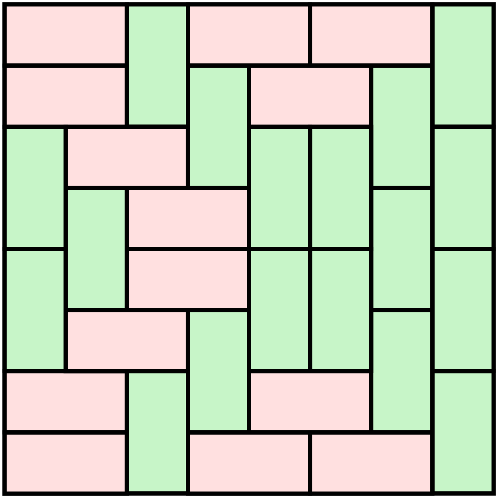

# Impaccare un massimo numero di barre 1x3 entro una griglia mxn

Ecco un massimo impaccamento di piastrelle 1x3 entro una griglia 2x4:

Un esercizio propedeutico: Stabilire per quali valori di $m$ ed $n$ esista un tiling perfetto della griglia mxn con barre 1x2 è la competenza che ti chiediamo di costruire ed esibire nell'esercizio tiling_1x2-bars_in_mxn-grids, che ti suggeriamo di considerare come propedeutico a questo, fanno parte di un medesimo percorso.

In questo esercizio affrontiamo insieme il problema di inserire il massimo numero di barre 1x3 entro una griglia mxn, dove i valori per $m$ ed $n$ sono dati in input.

Non ti servirà solo intuire come meglio incastrarle, ma anche la capacità di guardare le cose da fuori e convincerti di eventuali impossibilità.
In questo esercizio ti condurremo a maturare anche la tua capacità di dire no, ed esprimerla operativamente.

Quando si colloca una barra 1x3 nella griglia mxn, vengono interessate precisamente 3 celle. Indichiamo con T l'insieme delle triple di celle che corrispondano ai possibili collocamenti di una singola barra 1x3.
Un insieme $S$ di celle è detto un transversal di $T$ se:
$S$ ha intersezione non nulla con ogni tripla $t$ in $T$.
Ad esempio, $\{(i,j) : i%3 == 0 .OR. j%3 == 0\}$ è un transversal di $T$.

Considera ora di avere individuato un transversal $S$ di $T$.
Se così, allora puoi ben concludere che non vi è modo si impaccare più di $|S|$ barre, dove con $|S|$ si indica la cardinalità dell'insieme $S$ (ossia, il numero di celle in $S$).
Infatti, dato un qualsiasi packing valido, ogni barra del packing prenderà almeno un elemento di $S$ e le celle in $S$ assunte da due barre distinte, formano insiemi disgiunti dato che le barre non si sovrappongono.
Pertanto, il concetto di transversal ci fornisce un linguaggio per convincere l'interlocutore (King Arthur) o noi stessi che non si potrà mai impaccare più di un certo numero di barre, comunque ci si impegni.

Goal 1: dato un insieme $S$ di celle riconoscere se esso sia o meno un tranversal,
e, in caso contario, collocare nella griglia una barra 1x3 senza sovrapporsi ad alcuna cella in $S$. ($m,n \leq 100$)

Goal 2 [upper bound]: assegnati due numeri naturali $m$ ed $n$, computare un transversal di minima cardinalità. ($m,n \leq 100$)

Goal 3 [lower bound]: impaccare il maggior numero possibile di barre! ($m,n \leq 100$)

Goal 4: dire quale sia il massimo numero di barre impaccabili nella griglia. ($m,n \leq 100$)

Goal 5: dire quale sia la minima cardinalità di un transversal. ($m,n \leq 100$)

Goal 6: dire quale sia il massimo numero di barre impaccabili nella griglia. ($m,n \leq 1.000.000.000$)

Goal 7: dire quale sia la minima cardinalità di un transversal. ($m,n \leq 1.000.000.000$)

Questa volta abbiamo trovato modo di dare voce e verifica alle ragioni di non esistenza. Ma ecco una domanda per tè: riesci a proporre un possibile linguaggio per convincere del no anche per l'esercizio tiling_1x2-bars_in_mxn-grids?

DAG DEI GOALS:
La valutazione di alcuni goal è subordinata all'aver portato a segno altri goal.
Ecco la tabella dei prerequisiti:

* Goal 5: Goal 1
* Goal 7: Goal 5
* Goal 2: Goal 5
* Goal 6: Goal 4
* Goal 3: Goal 4
